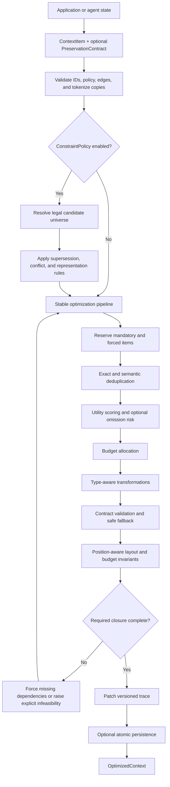

# ContextOS

ContextOS is a model-agnostic Python runtime for constructing bounded LLM context while
preserving explicit semantic, relational, and state-consistency constraints.

**Status:** v0.5.0 Research Preview. The runtime and evidence are suitable for reproducible
experimentation, not a claim of production readiness or universal long-context improvement.

## Why ContextOS exists

Long-running agents accumulate more state than can safely fit in every model call. Recency,
semantic relevance, sliding windows, and generic summarization help reduce tokens, but they can
discard information that is structurally mandatory:

- policies and negation;
- exact dates, numbers, identifiers, and citations;
- dependencies between operations and state;
- current values that supersede stale values;
- conflicting records that require an explicit resolution.

A conventional selector asks, “What is most relevant?” ContextOS additionally asks, “Which
context states are legal under the declared preservation constraints, and which valid state
provides the most utility within the available budget?”

## Architecture

Constraint enforcement is opt-in. The default path preserves the v0.4 optimizer behavior; an
enabled `ConstraintPolicy` wraps that stable pipeline with legal-state filtering and an
iterative dependency-closure check.



The optimizer works on copies of caller-owned items. It either returns a context within the
effective budget or raises a typed failure; it does not silently relax required constraints.
See [Architecture](docs/architecture.md) for the component contracts and compatibility boundary.

## Capabilities

- Typed context for messages, instructions, tools, code, documents, decisions, errors, plans,
  memory, and task state.
- Preservation contracts for required retention, numbers, dates, identifiers, citations,
  negation, and structured keys.
- Directed `REQUIRES`, `SUPERSEDES`, `CONTRADICTS`, and `DERIVED_FROM` relations with cycle-safe
  closure and explicit conflict policy.
- Exact and guarded semantic deduplication; relevance, importance, recency, novelty,
  dependency, and type-priority scoring.
- Optional omission-risk-aware allocation under a single authoritative token budget.
- Type-aware code, structured-data, evidence, conversation, and tool-output transformations.
- Deterministic validation of every lossy candidate, followed by safe fallback or explicit
  infeasibility.
- Position-aware layout, versioned per-item traces, in-memory persistence, and versioned SQLite
  persistence.
- Python SDK, CLI, deterministic baselines, offline benchmarks, provider-backed evaluation,
  immutable artifacts, bootstrap intervals, and runtime/token telemetry.

## Installation

ContextOS requires Python 3.11 or newer.

```bash
git clone https://github.com/Shubhank2604/ContextOS.git
cd ContextOS
python -m venv .venv
```

Activate the environment with `.venv\Scripts\Activate.ps1` on PowerShell or
`source .venv/bin/activate` on POSIX shells, then install the package:

```bash
python -m pip install --upgrade pip
python -m pip install -e .
```

Optional dependency groups are:

```bash
python -m pip install -e ".[semantic]"   # sentence-transformer embeddings
python -m pip install -e ".[openai]"     # explicit OpenAI benchmark runs
python -m pip install -e ".[benchmark]"  # LongBench preparation and analysis
python -m pip install -e ".[dev]"        # tests, lint, formatting, and mypy
```

The base package does not import Sentence Transformers, Hugging Face Datasets, or the OpenAI
SDK at startup.

## Quick start

This complete example uses only the base installation and the deterministic embedding provider:

```python
from datetime import UTC, datetime

from contextos import ContextItem, ContextOptimizer, ContextType, OptimizationPolicy

timestamp = datetime(2026, 1, 1, tzinfo=UTC)
item = ContextItem(
    id="task-1",
    content="Fix the authentication timeout without changing the stateless design.",
    type=ContextType.USER_MESSAGE,
    created_at=timestamp,
    updated_at=timestamp,
    importance=1.0,
    mandatory=True,
    evictable=False,
)

result = ContextOptimizer().optimize(
    "Fix the authentication timeout",
    [item],
    OptimizationPolicy.balanced(max_input_tokens=100),
)

print([selected.id for selected in result.selected_items])
print(result.trace.reduction_ratio)
```

The executable version is [examples/basic.py](examples/basic.py).

## Constraint-aware context

Here the requested task requires the current state, and the current state supersedes the stale
record. Required retention and exact-value preservation are explicit rather than inferred from
relevance scores.

```python
from datetime import UTC, datetime

from contextos import (
    ConstraintPolicy,
    ContextEdge,
    ContextItem,
    ContextOptimizer,
    ContextType,
    DependencyRelation,
    OptimizationPolicy,
    PreservationContract,
    RetentionPolicy,
)

timestamp = datetime(2026, 1, 1, tzinfo=UTC)
task = ContextItem(
    id="task",
    content="Fix the authentication timeout.",
    type=ContextType.USER_MESSAGE,
    created_at=timestamp,
    updated_at=timestamp,
    contract=PreservationContract(retention=RetentionPolicy.REQUIRED),
)
current = ContextItem(
    id="current",
    content="The approved timeout is 30 seconds.",
    type=ContextType.TASK_STATE,
    created_at=timestamp,
    updated_at=timestamp,
    contract=PreservationContract(preserve_numbers=True),
)
stale = ContextItem(
    id="stale",
    content="The approved timeout is 15 seconds.",
    type=ContextType.TASK_STATE,
    created_at=timestamp,
    updated_at=timestamp,
)
edges = [
    ContextEdge(
        source_id="task",
        target_id="current",
        relation=DependencyRelation.REQUIRES,
        weight=1.0,
    ),
    ContextEdge(
        source_id="current",
        target_id="stale",
        relation=DependencyRelation.SUPERSEDES,
        weight=1.0,
    ),
]

result = ContextOptimizer(
    edges=edges,
    constraint_policy=ConstraintPolicy.enforced(),
).optimize(
    "Fix the authentication timeout",
    [task, current, stale],
    OptimizationPolicy.balanced(max_input_tokens=64, risk_aware_allocation=True),
)

selected_ids = {item.id for item in result.selected_items}
assert selected_ids == {"task", "current"}
print(sorted(selected_ids))
print(result.trace.strategy)  # contextos_constraint_aware
```

More complete offline examples are available under [examples](examples/).

## CLI

```bash
contextos --help
contextos version
contextos inspect --input examples/data/coding_context.json
contextos optimize --input examples/data/coding_context.json --task "Fix authentication timeout" --budget 100 --trace-json out/trace.json
contextos benchmark --profile quick
```

Constraint-aware CLI optimization accepts a JSON `ConstraintPolicy` through
`--constraint-policy`. Use `contextos optimize --help` and `contextos benchmark --help` for the
complete command surface. The installed version command is `contextos version`—there is no
`contextos --version` alias in v0.5.0.

## Research results

The primary evaluation is a 90-case controlled **development** benchmark covering nine
constraint-failure families. Frozen v0.4 and Full Phase 5 received the same 80% effective token
budget.

| Metric | Frozen v0.4 | Full Phase 5 | Change |
|---|---:|---:|---:|
| Selection constraint violations | 77.78% | 11.11% | 85.7% relative reduction |
| GPT-5.4-mini answer violations | 22.22% | 11.11% | 50.0% relative reduction |
| GPT-5.4 answer violations | 33.33% | 11.11% | 66.7% relative reduction |
| Mean context reduction | 27.20% | 32.38% | +5.18 percentage points |
| Successful constrained executions | 90/90 | 80/90 | 10 explicit infeasibilities |

All 80 feasible Full Phase 5 executions preserved their required values. The remaining ten
were multi-hop cases whose protected closure could not fit; ContextOS returned explicit
overflow instead of corrupted or constraint-violating context. These are controlled results,
not held-out or production estimates.

## External evaluation

The retained LongBench run contains 25 cases each from 2WikiMQA, HotpotQA,
PassageRetrieval-en, and RepoBench-P. Across 98 matched successful Full Context/Phase 5 cases,
Phase 5 used 31.58% fewer context tokens. Task quality was mixed:

| Dataset | Full Context | Full Phase 5 | Paired delta, 95% CI |
|---|---:|---:|---:|
| 2WikiMQA F1 | 0.5844 | 0.6604 | +0.0760 `[-0.0360, 0.2000]` |
| HotpotQA F1 | 0.7470 | 0.5716 | -0.1753 `[-0.3400, -0.0386]` |
| Passage Retrieval | 1.0000 | 0.8800 | -0.1200 `[-0.2410, 0.0000]` |
| RepoBench-P similarity | 0.0578 | 0.0592 | +0.0026 `[-0.0509, 0.0574]` |

Phase 5 did not consistently outperform frozen v0.4, and the HotpotQA regression versus Full
Context is statistically non-zero under the recorded paired bootstrap interval. Unlike task
metrics are intentionally not collapsed into a universal quality score.

The 4K–32K real-provider positional experiment reached 100% exact match for every strategy and
position. That is a ceiling-effect null: it neither reproduces nor demonstrates mitigation of
the degradation reported in *Lost in the Middle*.

See [Research](docs/research.md), [Known limitations](docs/limitations.md), and the
[research-readiness report](benchmarks/reports/v0.5.0-research-readiness.md) for the complete
interpretation.

## Reproducing the evidence

Offline checks do not need model credentials:

```bash
ruff check .
ruff format --check .
mypy
pytest
contextos benchmark --profile quick
contextos benchmark constraints --output-directory out/constraints
contextos benchmark phase5-ablation --output-directory out/phase5-ablation
```

LongBench preparation requires the `benchmark` extra and downloads the pinned external data.
Model-backed commands require an explicitly installed provider extra, an API key in the process
environment, and an explicitly selected model. They are manual-only and never run in normal CI.

The six reviewed evidence bundles under [benchmarks/results](benchmarks/results/) contain raw
cases, predictions, configuration, environment provenance, metrics, and reports. Model-backed
constraint and LongBench artifacts identify evaluated source revision
`f1e92ff39212ee4996273949e21d2f9caa375c20`; frozen v0.4 is
`4fdd88391300c56ad17af5458897ccdd08d6f7bf`. Third-party LongBench case records remain subject
to the notices in [THIRD_PARTY_DATA.md](benchmarks/results/THIRD_PARTY_DATA.md).

Detailed commands and artifact rules are in [Benchmarking](benchmarks/README.md).

## Limitations

- The controlled constraint set co-evolved with the runtime; held-out validation is still
  required.
- Primary constraint runs use two snapshots from one provider/model family.
- Explicit infeasibility improves safety but reduces coverage under tight budgets.
- LongBench quality effects are workload-dependent and include a significant HotpotQA
  regression.
- The positional benchmark was non-discriminating.
- Controlled p95 optimizer latency is approximately 4–6 ms, while LongBench p95 is
  approximately 188–325 ms; no universal sub-10-ms claim is valid.
- ContextOS constructs model input. It does not verify model answers, prevent prompt injection,
  or guarantee downstream instruction following.

## Development

```bash
python -m pip install -e ".[dev]"
ruff check .
ruff format --check .
mypy
pytest
```

The public runtime remains backwards compatible with the unconstrained v0.4 path. v0.5.0 adds
constraint enforcement only when `ConstraintPolicy.enabled` is true. The frozen research
runtime is preserved in Git history; release cleanup does not modify its source behavior.

## License

ContextOS code and project-authored documentation are available under the [MIT License](LICENSE).
Retained third-party benchmark inputs keep their upstream licenses and attribution requirements.
